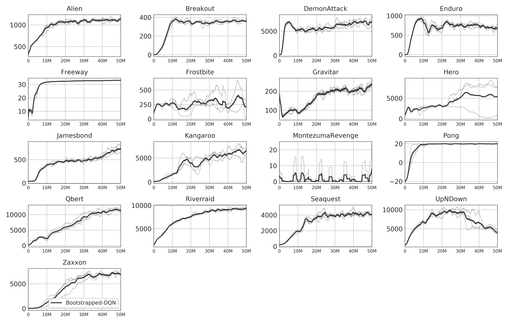

# BootstrappedDQN

Implementation of BootstrappedDQN (Osband et. al 2016) using OpenAI baselines (version 0.1.3).

We recommend using the standard OpenAI baselines setup using python3.

To train the network :

```bash
python train.py --env=(Game)
```
In case the train file is not viewable, please find the files in the "main_files" directory.

Results from training over 50M steps:


